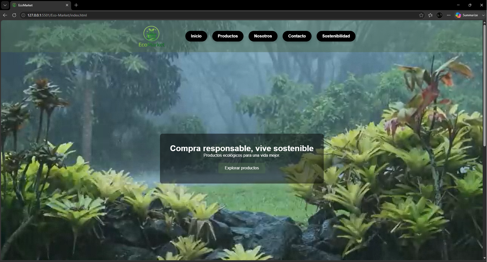
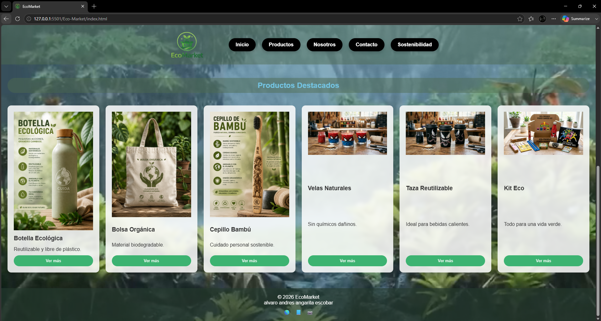
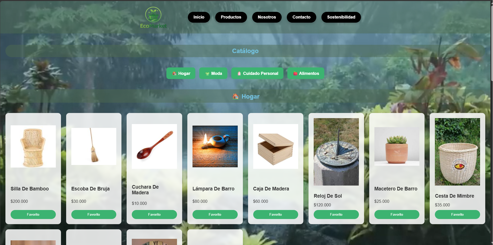
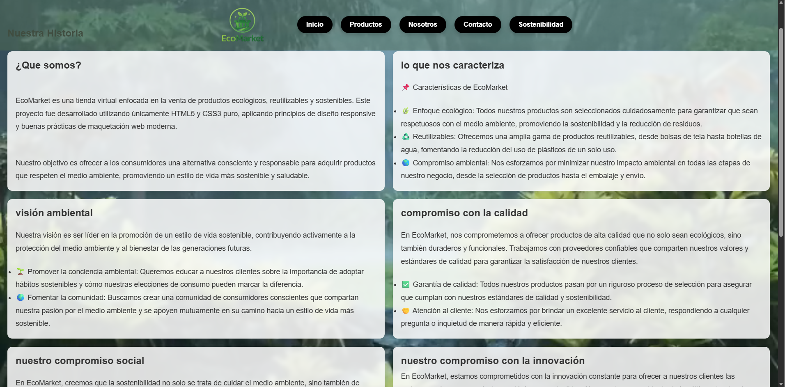
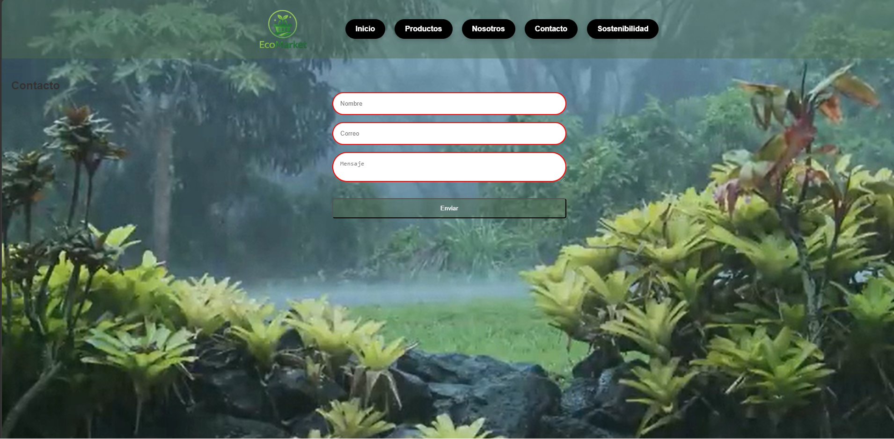
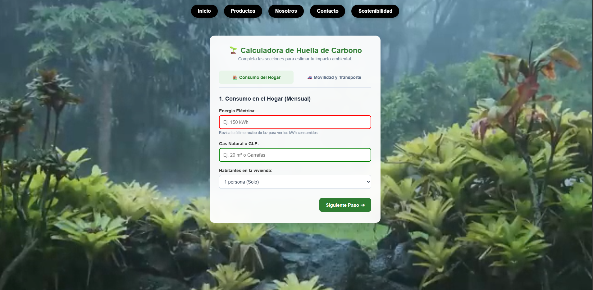
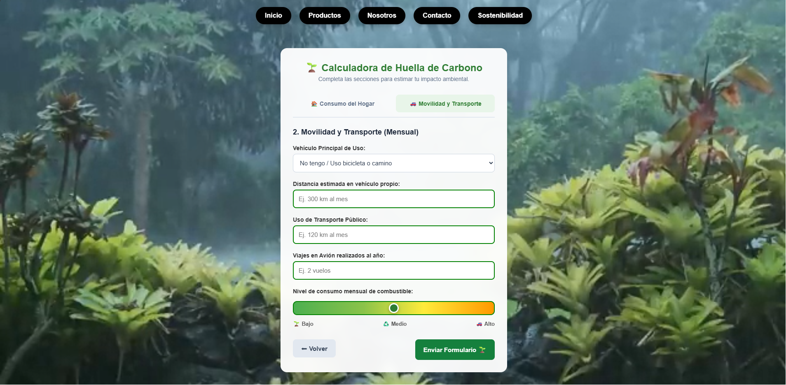

# 🌱 EcoMarket

EcoMarket es una tienda virtual enfocada en la venta de productos ecológicos, reutilizables y sostenibles. Este proyecto fue desarrollado utilizando únicamente HTML5 y CSS3 puro, aplicando principios de diseño responsive y buenas prácticas de maquetación web moderna.

El objetivo principal de EcoMarket es ofrecer una experiencia visual limpia, atractiva y amigable para los usuarios interesados en el consumo responsable y el cuidado del medio ambiente.

---

# 📌 Características del Proyecto

- Diseño moderno y minimalista
- Interfaz responsive (Mobile First)
- Uso de HTML5 semántico
- Estilos avanzados con CSS3
- Animaciones y efectos hover
- Validaciones visuales con CSS
- Organización modular de archivos
- Sin uso de JavaScript
- Sin frameworks externos

---

# 🖥️ Vistas del Proyecto

## 🏠 Página de Inicio
Contiene:
- Header con navegación
- Banner principal (Hero Section)
- Productos destacados
- Footer con redes sociales

## 🛍️ Página de Productos
Incluye:
- Grid responsive de productos
- Sidebar de filtros visuales
- Tarjetas interactivas
- Paginación visual

## 🌿 Página Sobre Nosotros
Presenta:
- Historia de EcoMarket
- Valores ecológicos
- Testimonios de clientes
- Diseño con Flexbox

## 📩 Página de Contacto
Cuenta con:
- Formulario responsive
- Validaciones visuales
- Redes sociales animadas
- Diseño limpio y accesible

---

# 🎨 Paleta de Colores

| Color | Código |
|---|---|
| Verde Principal | #2ecc71 |
| Verde Oscuro | #27ae60 |
| Beige | #f5f5dc |

---

# 🛠️ Tecnologías Utilizadas

- HTML5
- CSS3
- Flexbox
- CSS Grid
- Media Queries
- Pseudo-clases CSS

---

# 📁 Estructura del Proyecto

```plaintext
EcoMarket/
├── css/
│   ├── main.css
│   ├── layout.css
│   ├── components.css
│   └── animations.css
├── img/
│   ├── products/
│   ├── icons/
│   └── hero/
├── views/
│   ├── productos.html
│   ├── sobre-nosotros.html
│   └── contacto.html
├── index.html
└── README.md






